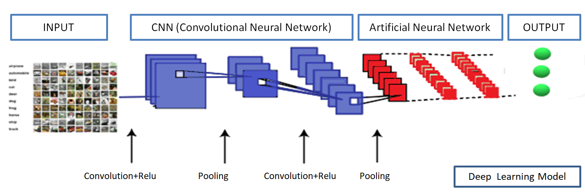
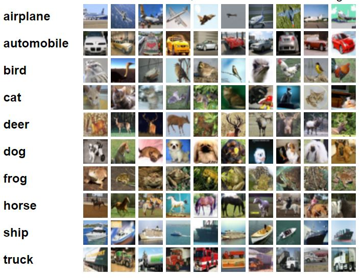

# Recognition and Classification of Objects in Photographs with Deep Learning Algorithms

This project focuses on object recognition and classification in photographs using deep learning techniques. The CIFAR-10 dataset, which contains 60,000 32x32 color images in 10 classes, is used for training and testing the Convolutional Neural Network (CNN) model.

  

## Overview
This project builds a CNN model using TensorFlow and Keras to classify objects in photographs. The CIFAR-10 dataset is used for model training, where images are classified into 10 categories: airplane, automobile, bird, cat, deer, dog, frog, horse, ship, and truck.

## Dataset
The project uses the [CIFAR-10 dataset](https://www.cs.toronto.edu/~kriz/cifar.html) consisting of 50,000 training images and 10,000 test images in 10 classes. Each image is a 32x32 color image with 3 RGB channels.

You can visualize a sample of the dataset:

## Model Architecture
The CNN model consists of the following layers:
- **Convolutional Layers**: Extract features from the images.
- **Pooling Layers**: Downsample the feature maps.
- **Fully Connected Layers**: Use the features to classify the images into one of the 10 classes.

## Training Results

The CNN model was trained for 5 epochs. Below is a summary of the training and evaluation results:

### Training Accuracy and Loss

| Epoch | Training Accuracy | Training Loss |
|-------|-------------------|---------------|
| 1     | 87.1%             | 0.3629        |
| 2     | 87.8%             | 0.3431        |
| 3     | 89.2%             | 0.3109        |
| 4     | 89.7%             | 0.2911        |
| 5     | 90.7%             | 0.2663        |

### Test Accuracy and Loss

The model's performance on the test dataset:

| Metric         | Value     |
|----------------|-----------|
| Test Accuracy  | 68.7%     |
| Test Loss      | 1.2979    |

